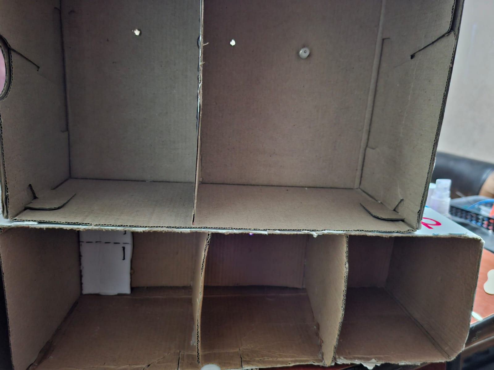
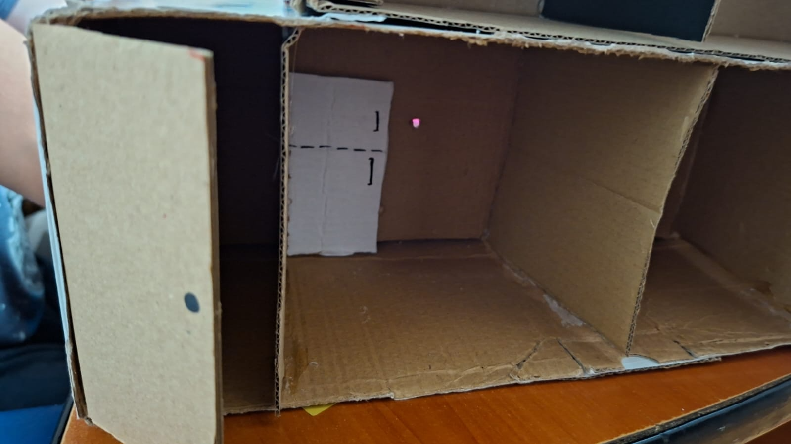
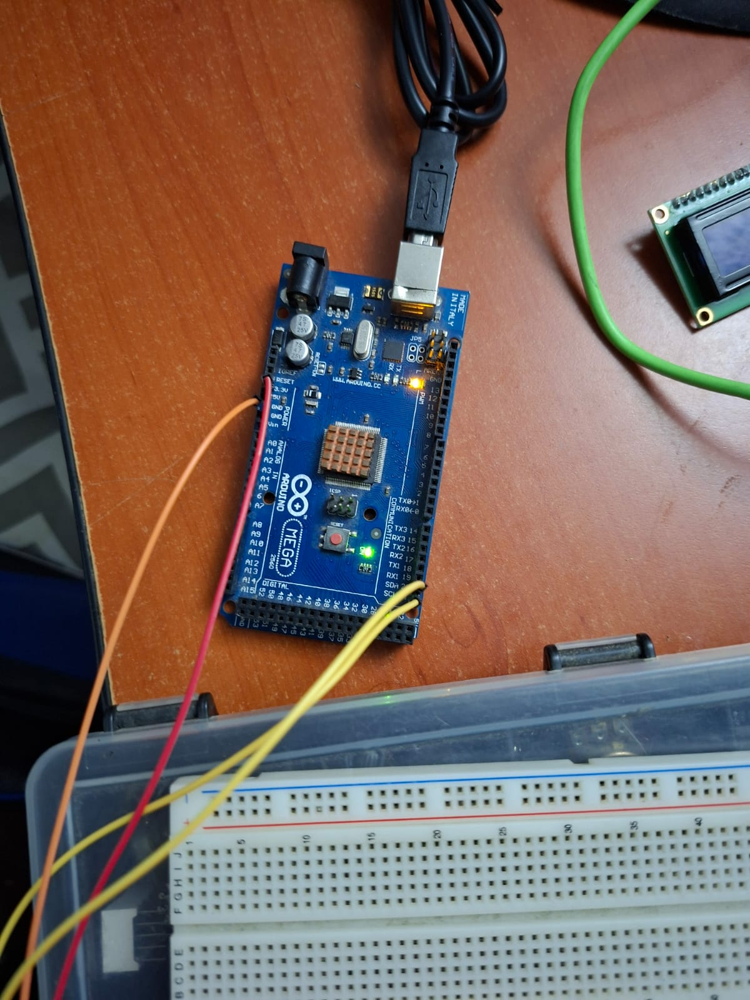
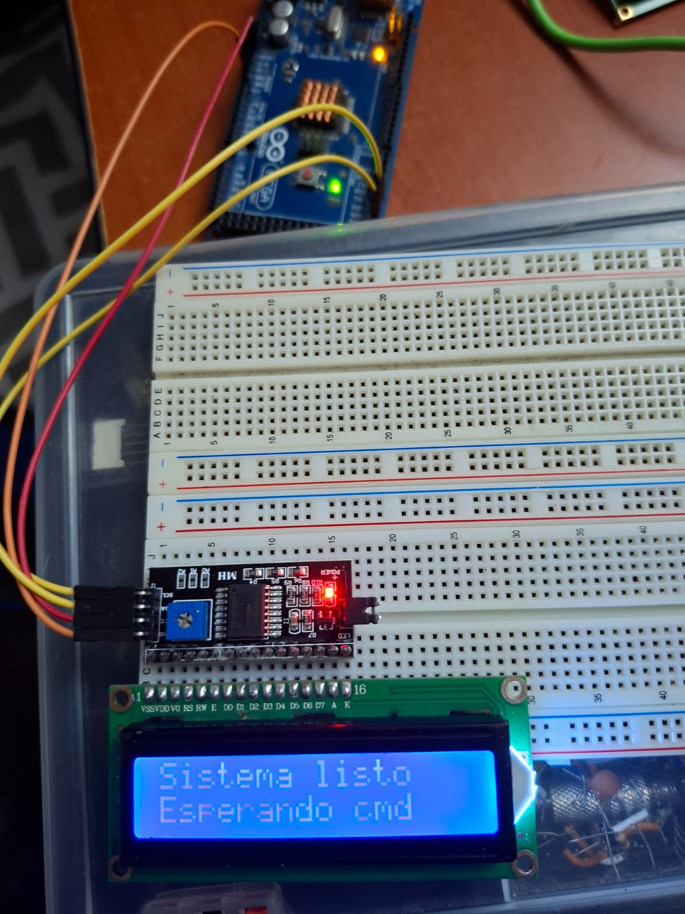

# Casa Inteligente con Control de Ambientes y Ventilador Automatizado
**Lógica Combinacional y Secuencial — Organización Computacional**

**Universidad San Carlos de Guatemala**  
**Facultad de Ingeniería — Escuela de Ingeniería en Ciencias y Sistemas**  
**Curso:** Organización Computacional  
**Semestre:** 1S 2026  
**Grupo:** 11  
**Sección:** C  

| No. | Integrante | Carné |
|:---:|------------|-------|
| 1 | Javier Rivas | 202303204 |
| 2 | Daniel Aceituno | 202300579 |
| 3 | Rene Gutiérrez | 202300540 |
| 4 | Ana Nufio | 202400452 |

---

## Índice

1. [Introducción](#introducción)
2. [Objetivos](#objetivos)
3. [Descripción del Sistema](#descripción-del-sistema)
4. [Componentes Utilizados](#componentes-utilizados)
5. [Diagrama Esquemático del Circuito](#diagrama-esquemático-del-circuito)
6. [Código Fuente](#código-fuente)
7. [Formato del Archivo .org](#formato-del-archivo-org)
8. [Tabla de Direcciones EEPROM](#tabla-de-direcciones-eeprom)
9. [Presupuesto Estimado](#presupuesto-estimado)
10. [Fotos del Desarrollo](#fotos-del-desarrollo)
11. [Conclusiones Técnicas](#conclusiones-técnicas)
12. [Anexos](#anexos)

---

## Introducción

En las viviendas convencionales, el control de iluminación y dispositivos eléctricos se realiza de forma manual e independiente, lo que limita la eficiencia energética, la comodidad y la personalización del ambiente. Este proyecto busca superar estas limitaciones mediante el diseño e implementación de una maqueta funcional de una casa inteligente.

El sistema integra el control centralizado de luces por ambientes, un sistema automatizado de ventilación y un mecanismo de apertura de puerta mediante servomotor, todo gestionado desde una interfaz remota vía Bluetooth o desde una PC a través de puerto serial.

La maqueta fue construida utilizando dos cajas de zapatos como estructura base, representando dos plantas: la planta baja contiene sala, comedor y cocina, mientras que la planta alta contiene baño y habitación. Cada ambiente cuenta con LEDs que simulan sistemas de iluminación real.

---

## Objetivos

### General

Diseñar e implementar una maqueta funcional de una casa inteligente que permita configurar y activar escenas luminosas predefinidas mediante un archivo `.org`, almacenadas en memoria EEPROM del Arduino, y controlar dispositivos como luces y un ventilador mediante comandos locales o inalámbricos, demostrando la integración práctica de microcontroladores, gestión de memoria y comunicación digital en sistemas automatizados.

### Específicos

Implementar un sistema de almacenamiento de escenas luminosas en la memoria EEPROM interna del Arduino, garantizando persistencia de configuraciones tras reinicios y permitiendo su recuperación sin intervención manual.

Diseñar una interfaz de configuración que permita cargar escenas de iluminación y ventilación desde una PC mediante un archivo con extensión `.org`, validando su sintaxis línea por línea y procesando los comandos para actualizar los estados en EEPROM.

Integrar un módulo Bluetooth HC-06 para permitir el control remoto de los ambientes desde un dispositivo móvil, interpretando comandos predefinidos y proporcionando retroalimentación inmediata mediante una pantalla LCD I2C y LEDs de estado.

Construir una maqueta física funcional que integre todos los subsistemas del hogar inteligente (iluminación por zonas, ventilador DC, servomotor de puerta) de forma coordinada y estable, demostrando la viabilidad de un sistema domótico de bajo costo basado en microcontroladores.

---

## Descripción del Sistema

### Arquitectura General

El sistema se centra en un **Arduino Mega** como unidad de control principal. Recibe comandos desde dos fuentes:

- **Puerto Serial (USB):** para cargar archivos de configuración `.org` desde una PC.
- **Módulo Bluetooth HC-06:** para recibir comandos remotos desde un dispositivo móvil.

### Ambientes y Actuadores

| Ambiente     | LEDs | Actuador extra              |
|--------------|------|-----------------------------|
| Sala         | 2    | —                           |
| Comedor      | 2    | —                           |
| Cocina       | 3    | —                           |
| Baño         | 1    | —                           |
| Habitación   | 2    | Motor DC (ventilador techo) |
| Entrada      | —    | Servomotor (puerta)         |

### Modos de Operación

| Comando         | Estado LEDs        | Ventilador |
|-----------------|--------------------|------------|
| `modo_fiesta`   | Alternándose       | ON         |
| `modo_relajado` | OFF                | OFF        |
| `modo_noche`    | OFF                | OFF        |
| `encender_todo` | Todos ON           | ON         |
| `apagar_todo`   | Todos OFF          | OFF        |

### LEDs de Estado

| LED   | Color | Función                                                        |
|-------|-------|----------------------------------------------------------------|
| L1    | Azul  | Encendido constante cuando el sistema está activo              |
| L2    | Verde | Parpadea 3 veces al cargar exitosamente un archivo `.org`      |
| L3    | Rojo  | Encendido si hay error en el archivo `.org` o fallo en EEPROM |

### Pantalla LCD (I2C 16x2)

| Comando         | Línea 1           | Línea 2                  |
|-----------------|-------------------|--------------------------|
| `modo_fiesta`   | Modo: FIESTA.     | Ventilador: ON           |
| `modo_relajado` | Modo: RELAJADO.   | Ventilador: OFF          |
| `modo_noche`    | Modo: NOCHE.      | Ventilador: OFF          |
| `encender_todo` | LED'S: ON.        | Ventilador: ON.          |
| `apagar_todo`   | LED'S: OFF.       | Ventilador: OFF.         |
| Error           | ERROR:            | Modo invalido            |

---

## Componentes Utilizados

| Componente                    | Código / Modelo | Cantidad |
|-------------------------------|-----------------|----------|
| Arduino Mega                  | N/a             | 1        |
| Módulo Bluetooth              | HC-06           | 1        |
| Pantalla LCD I2C 16x2         | I2C (16x2)      | 1        |
| Motor DC (ventilador)         | N/a             | 1        |
| Servomotor (puerta)           | SG90            | 1        |
| LEDs de ambientes             | Varios colores  | 11       |
| LED Azul (sistema activo)     | N/a             | 1        |
| LED Verde (éxito config)      | N/a             | 1        |
| LED Rojo (error)              | N/a             | 1        |
| Transistor NPN                | 2N2222A         | 1        |
| Push Button (puerta)          | N/a             | 1        |
| Resistencias 220Ω             | N/a             | ~15      |
| Resistencias 10kΩ             | N/a             | ~2       |
| Protoboard                    | N/a             | 1        |
| Cables jumper                 | N/a             | varios   |
| Material maqueta (cajas)      | Cartón          | 2        |

---

### Distribución de Pines — Arduino Mega

| Pin  | Componente                    | Descripción              |
|------|-------------------------------|--------------------------|
| 2    | LED Sala 1                    | Salida digital           |
| 3    | LED Sala 2                    | Salida digital           |
| 4    | LED Comedor 1                 | Salida digital           |
| 5    | LED Comedor 2                 | Salida digital           |
| 6    | LED Cocina 1                  | Salida digital           |
| 7    | LED Cocina 2                  | Salida digital           |
| 8    | LED Cocina 3                  | Salida digital           |
| 9    | LED Baño                      | Salida digital           |
| 10   | LED Habitación 1              | Salida digital           |
| 11   | LED Habitación 2              | Salida digital           |
| 12   | Motor DC (transistor NPN)     | Salida digital           |
| 13   | Servomotor (puerta)           | PWM                      |
| 22   | LED Azul (estado)             | Salida digital           |
| 23   | LED Verde (éxito)             | Salida digital           |
| 24   | LED Rojo (error)              | Salida digital           |
| 25   | Botón puerta                  | Entrada digital          |
| TX1/RX1 | HC-06 Bluetooth           | Serial1                  |
| SDA/SCL | LCD I2C                   | I2C (20/21 en Mega)      |

---

## Formato del Archivo .org

El archivo `.org` permite definir los estados de luces y ventilador para cada modo. Se envía desde una PC via puerto serial (USB).

### Estructura y Reglas de Sintaxis

- Las líneas que comienzan con `//` son comentarios y se ignoran.
- El archivo debe comenzar con `conf_ini` y terminar con `conf:fin`.
- Cada modo se define con su nombre exacto (`modo_fiesta`, `modo_relajado`, etc.).
- Las líneas de configuración siguen el formato `Clave: Valor`.
- Valores válidos: `ON`, `OFF`, `Alternandose`.

### Errores de Sintaxis Detectados

| Error de entrada           | Mensaje en LCD          | LED activado |
|----------------------------|-------------------------|--------------|
| Falta `conf_ini`           | Error: Archivo .org     | Rojo         |
| Falta `conf:fin`           | Error: Archivo .org     | Rojo         |
| Clave desconocida          | Error: Archivo .org     | Rojo         |
| Valor inválido (`abc`)     | Error: Archivo .org     | Rojo         |
| Modo desconocido           | ERROR: Modo invalido    | Rojo         |

---

## Tabla de Direcciones EEPROM

Cada modo ocupa un bloque de direcciones en la EEPROM del Arduino. Se utilizan bytes individuales para cada parámetro de cada modo.

| Dirección | Modo            | Parámetro    | Valor 0 | Valor 1        |
|-----------|-----------------|--------------|---------|----------------|
| 0         | modo_fiesta     | LEDs         | OFF     | Alternandose   |
| 1         | modo_fiesta     | Ventilador   | OFF     | ON             |
| 10        | modo_relajado   | LEDs         | OFF     | ON             |
| 11        | modo_relajado   | Ventilador   | OFF     | ON             |
| 20        | modo_noche      | LEDs         | OFF     | ON             |
| 21        | modo_noche      | Ventilador   | OFF     | ON             |
| 30        | encender_todo   | LEDs         | OFF     | ON             |
| 31        | encender_todo   | Ventilador   | OFF     | ON             |
| 40        | apagar_todo     | LEDs         | OFF     | ON             |
| 41        | apagar_todo     | Ventilador   | OFF     | ON             |
| 100       | Checksum/Flag   | Configurado  | 0x00    | 0xAA (válido)  |

> **Nota:** El byte en dirección 100 actúa como bandera de integridad. Si su valor es `0xAA`, la EEPROM contiene configuración válida. De lo contrario, se cargan valores por defecto.

---

## Presupuesto Estimado

| Componente                    | Cantidad | Precio Unit. (Q) | Total (Q) |
|-------------------------------|----------|------------------|-----------|
| Arduino Mega                  | 1        | Q 120.00         | Q 120.00  |
| Módulo Bluetooth HC-06        | 1        | Q 45.00          | Q 45.00   |
| Pantalla LCD I2C 16x2         | 1        | Q 40.00          | Q 40.00   |
| Motor DC pequeño              | 1        | Q 15.00          | Q 15.00   |
| Servomotor SG90               | 1        | Q 25.00          | Q 25.00   |
| LEDs (varios colores)         | 14       | Q 1.00           | Q 14.00   |
| Transistor 2N2222A            | 2        | Q 2.00           | Q 4.00    |
| Resistencias (pack)           | 1        | Q 10.00          | Q 10.00   |
| Push Button                   | 2        | Q 2.00           | Q 4.00    |
| Protoboard                    | 1        | Q 30.00          | Q 30.00   |
| Cables jumper (pack)          | 1        | Q 20.00          | Q 20.00   |
| Material maqueta (cartón)     | —        | Q 0.00           | Q 0.00    |
| Pegamento, pintura, decoración| —        | Q 20.00          | Q 20.00   |
| **TOTAL**                     |          |                  | **Q 347.00** |

---

## Fotos del Desarrollo

### Maqueta Física

### Circuito Electrónico

---

## Conclusiones Técnicas

Las siguientes conclusiones están directamente relacionadas con cada uno de los objetivos específicos planteados al inicio del proyecto.

### Almacenamiento persistente en EEPROM

La implementación del sistema de almacenamiento en EEPROM demostró que es posible mantener la configuración de escenas luminosas de forma completamente persistente ante reinicios y cortes de energía. El uso de una bandera de integridad en la dirección 100 resultó clave para distinguir entre una EEPROM con datos válidos y una sin inicializar, evitando comportamientos inesperados al encender el sistema por primera vez. Se comprobó además que la EEPROM del Arduino Mega soporta suficientes ciclos de escritura para el tipo de uso que demanda este proyecto.

### Interfaz de configuración con archivo .org

El diseño del parser para el archivo `.org` permitió comprender la importancia de la validación de datos de entrada en sistemas embebidos. Implementar la lectura línea por línea vía puerto serial obligó a manejar correctamente los tiempos de recepción de datos y los caracteres de fin de línea, aspectos que no son evidentes en programación de alto nivel. La detección temprana de errores de sintaxis —activando el LED rojo y mostrando el mensaje en LCD— aportó robustez al sistema y facilitó enormemente las pruebas de integración.

### Control remoto vía Bluetooth con retroalimentación visual

La integración del módulo HC-06 evidenció que la comunicación serial inalámbrica, aunque simple en concepto, requiere atención especial en cuanto a la velocidad de baudios, el manejo de caracteres de retorno de carro y la sincronización con otros procesos del sistema. La retroalimentación inmediata en la pantalla LCD tras cada comando Bluetooth mejoró notablemente la experiencia de uso y facilitó la detección de fallos durante las pruebas. Se confirmó que bloquear los comandos Bluetooth durante la carga del archivo `.org` es indispensable para evitar condiciones de carrera en el sistema.

### Integración física y estabilidad del sistema domótico

La construcción de la maqueta física con cajas de zapatos demostró que es posible implementar un sistema domótico funcional con materiales económicos y accesibles. La integración coordinada de todos los subsistemas —LEDs por zona, motor DC, servomotor y módulo LCD— puso en evidencia que la correcta planificación de pines y el uso de `millis()` en lugar de `delay()` son fundamentales para que el sistema responda de forma fluida y sin bloqueos. Este proyecto confirmó que los microcontroladores de bajo costo como Arduino son una plataforma viable para prototipos de automatización residencial real.

---
